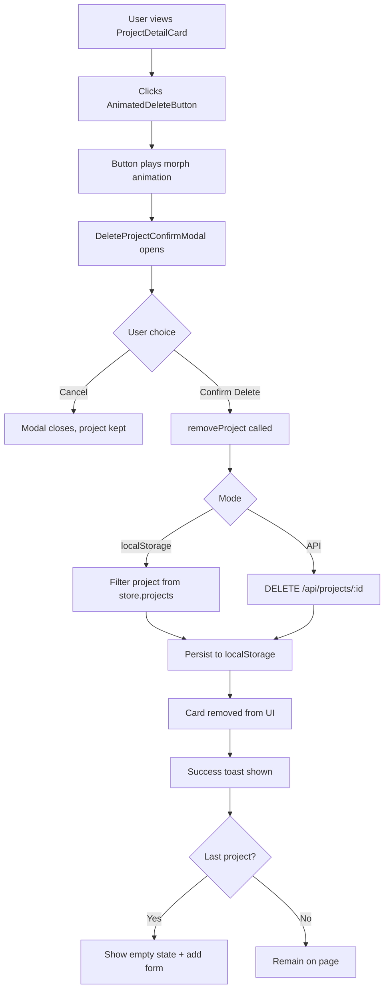
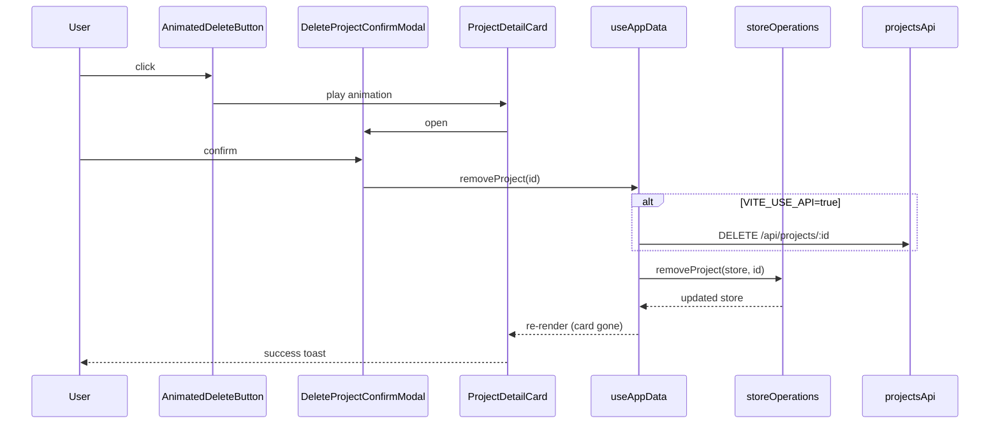

# Design: Delete Project with Animated Button

**Project:** Nirmiti CRM v4  
**Branch:** `version4`  
**Status:** Design — ready for implementation  
**Date:** 2026-07-11

---

## 1. Overview

Add the ability to delete saved projects from the **Setup** (`/setup`) and **Projects** (`/projects`) pages. Each project card gets an animated **Delete** button (user-provided SVG design). Deletion requires a confirmation alert before proceeding, and shows a success message after the project is removed.

### Goals

- Let users remove a project they no longer need
- Prevent accidental deletion with a clear confirmation step
- Use the provided animated trash → “Delete” button design
- Work in both **localStorage** mode (default) and **API** mode (`VITE_USE_API=true`)

### Non-goals (v1)

- Cascade-delete customers/bookings tied to the project
- Undo / soft-delete
- Bulk delete multiple projects at once

---

## 2. User Flow



### Step-by-step

1. User sees a saved project in `ProjectDetailCard` on `/setup` or `/projects`.
2. User clicks the animated delete button (top-right of card header).
3. Button plays the trash → “Delete” morph animation (~1.6s total).
4. A confirmation modal appears:
   - Title: **Delete Project?**
   - Body: warns that **"{project.name}"** and all its building/wing/unit configuration will be permanently removed.
   - Actions: **Cancel** (gray) | **Delete Project** (red)
5. On confirm:
   - Project is removed from app state
   - API call fires if `VITE_USE_API=true`
   - Card disappears
   - Green success toast: **"Project deleted successfully"**
6. If it was the last project:
   - Setup page re-opens the “Add Project” form automatically
   - “Go to Dashboard” button hides

---

## 3. UI Design

### 3.1 Placement — `ProjectDetailCard`

```
┌─────────────────────────────────────────────────────────────┐
│ ✓  Sunrise Heights  [residential] [Saved]     [DELETE BTN] │
│    120 flats · 2 buildings                                  │
├─────────────────────────────────────────────────────────────┤
│  Building 1 · 1 wing                                        │
│  ┌──────────────────┐  ┌──────────────────┐                │
│  │ Wing A · 10 fl.. │  │                  │                │
│  └──────────────────┘  └──────────────────┘                │
└─────────────────────────────────────────────────────────────┘
```

- Delete button sits in the **card header**, right-aligned, vertically centered with the title row.
- Does not overlap the green “Saved” badge on small screens (button scales down to ~100×32px).

### 3.2 Animated Delete Button (user design)

| Property | Value |
|----------|-------|
| Base size | 120 × 40 px (scales to fit card) |
| Background | `#0502B7` (deep blue) |
| Border radius | 8 px |
| Icon color | White |
| Animation | Trash icon morphs → “Delete” text → loops on click |

**Behavior:**

- **Default state:** small trash-can icon on blue pill button
- **On click:** 8-step keyframe sequence (~1.6s):
  1. Button shrinks slightly
  2. Trash icon morphs
  3. “Delete” letter paths animate in one-by-one
  4. Animation resets and loops while modal is open
- **Accessibility:** `aria-label="Delete project"`, keyboard focusable (`button` element wrapping SVG)

**Implementation files (planned):**

| File | Purpose |
|------|---------|
| `src/components/ui/AnimatedDeleteButton.tsx` | React wrapper, click handler, `useId()` for unique SVG element IDs |
| `src/components/ui/animatedDeleteButton.css` | All `@keyframes` from user HTML (scoped under `.animated-delete-btn`) |

> **Note:** Multiple cards on one page each get their own button instance. SVG element IDs must be prefixed with React `useId()` to avoid `getElementById` collisions.

### 3.3 Confirmation Modal — `DeleteProjectConfirmModal`

Follows the same pattern as [`MarkInactiveModal.tsx`](../src/components/pages/customers/MarkInactiveModal.tsx): fixed overlay, centered card, red warning header.

```
┌──────────────────────────────────────────┐
│ ⚠  Delete Project?                    ✕ │
├──────────────────────────────────────────┤
│  ┌────────────────────────────────────┐  │
│  │ ⚠ This will permanently delete     │  │
│  │   "Sunrise Heights" including all  │  │
│  │   buildings, wings, and units.     │  │
│  │   This cannot be undone.           │  │
│  └────────────────────────────────────┘  │
│                                          │
│         [ Cancel ]  [ Delete Project ]   │
└──────────────────────────────────────────┘
```

| Element | Style |
|---------|-------|
| Overlay | `bg-black/40 backdrop-blur-sm z-30` |
| Header | `bg-red-50 border-red-100`, `AlertTriangle` icon |
| Warning box | `bg-amber-50 border-amber-200` |
| Cancel button | Gray outline |
| Delete button | `bg-red-600 hover:bg-red-700 text-white` |
| Delete loading | Spinner + disabled state while API call runs |

### 3.4 Success Toast

Inline toast (same pattern as [`CustomerSales.tsx`](../src/components/pages/customers/CustomerSales.tsx)):

- Position: top-center or bottom-center of page content area
- Message: `Project "{name}" deleted successfully`
- Auto-dismiss: 3 seconds
- Style: green background, white text

---

## 4. Data Layer

### 4.1 New store operation

**File:** [`src/lib/storage/storeOperations.ts`](../src/lib/storage/storeOperations.ts)

```ts
export function removeProject(store: AppStore, projectId: string): AppStore {
  return {
    ...store,
    projects: store.projects.filter((p) => p.id !== projectId),
  };
}
```

### 4.2 New hook method

**File:** [`src/hooks/useAppData.ts`](../src/hooks/useAppData.ts)

```ts
const removeProject = useCallback(
  async (projectId: string) => {
    if (!store) return;
    if (USE_API) {
      await apiRepository.projects.remove(projectId);
    }
    persist(removeProjectOp(store, projectId));
  },
  [store, persist]
);
```

Expose `removeProject` in the return object (auto-available via `AppDataContext`).

### 4.3 API (already defined)

**File:** [`src/lib/api/projects/projects.ts`](../src/lib/api/projects/projects.ts)

| Method | URL | Response |
|--------|-----|----------|
| `DELETE` | `/api/projects/:id` | `{ deleted: boolean }` |

Documented in [`docs/BACKEND_API_SPEC.md`](./BACKEND_API_SPEC.md).

---

## 5. Component Changes

### 5.1 `ProjectDetailCard` — add delete

**File:** [`src/components/pages/projects/Projects.tsx`](../src/components/pages/projects/Projects.tsx)

```ts
export function ProjectDetailCard({
  project,
  onDelete,
}: {
  project: ProjectData;
  onDelete?: (project: ProjectData) => void;
}) { ... }
```

- Renders `AnimatedDeleteButton` in header when `onDelete` is provided
- Manages local `confirmOpen` state for `DeleteProjectConfirmModal`
- Button click → play animation → open modal
- Modal confirm → call `onDelete(project)`

### 5.2 `ProjectsPage` — wire delete + empty state

```ts
export function ProjectsPage({
  projects,
  onCreate,
  onDelete,        // NEW
  deleteToast,     // NEW (optional, for success message)
  ...
})
```

- Pass `onDelete` to each `ProjectDetailCard`
- `useEffect`: when `projects.length === 0`, set `showForm = true`

### 5.3 `SetupShell` — same wiring

**File:** [`src/app/App.tsx`](../src/app/App.tsx)

- Add `onDelete` prop to `SetupShell`
- Pass to `ProjectDetailCard`
- Same empty-state `useEffect` for last project deleted

### 5.4 Routes — connect context

**File:** [`src/app/routePages.tsx`](../src/app/routePages.tsx)

```ts
// SetupRoute
const { projects, addProject, removeProject } = useAppDataContext();
<SetupShell onDelete={(p) => removeProject(p.id)} ... />

// ProjectsRoute
const { projects, addProject, removeProject } = useAppDataContext();
<ProjectsPage onDelete={(p) => removeProject(p.id)} ... />
```

---

## 6. Architecture Diagram



---

## 7. Edge Cases

| Case | Behavior |
|------|----------|
| Delete last project on `/setup` | Empty state shown; add-project form opens automatically |
| Delete while API is down | Show error in modal: “Failed to delete. Try again.” Keep project in list |
| Double-click delete | Disable confirm button while request is in-flight |
| Cancel modal | Close modal, no state change |
| Project has linked customers | v1: allow delete (customers remain; site filter may show stale name) |
| Refresh after delete | Project stays deleted (persisted to localStorage / API) |

---

## 8. Files to Create / Modify

### Create

| File | Description |
|------|-------------|
| `src/components/ui/AnimatedDeleteButton.tsx` | Animated SVG delete button |
| `src/components/ui/animatedDeleteButton.css` | Keyframe animations from user HTML |
| `src/components/pages/projects/DeleteProjectConfirmModal.tsx` | Confirmation alert modal |

### Modify

| File | Change |
|------|--------|
| `src/lib/storage/storeOperations.ts` | Add `removeProject()` |
| `src/hooks/useAppData.ts` | Add `removeProject()` callback |
| `src/components/pages/projects/Projects.tsx` | Update `ProjectDetailCard`, `ProjectsPage` |
| `src/app/App.tsx` | Wire `SetupShell` with `onDelete` |
| `src/app/routePages.tsx` | Pass `removeProject` from context |

### No changes needed

| File | Reason |
|------|--------|
| `src/lib/api/projects/projects.ts` | `remove()` already exists |
| `docs/BACKEND_API_SPEC.md` | `DELETE /api/projects/:id` already documented |

---

## 9. Testing Checklist

- [ ] Login → `/setup` → add project → delete button visible on card
- [ ] Click delete → animation plays → confirmation modal opens
- [ ] Cancel → modal closes, project still listed
- [ ] Confirm → project removed, success toast shown
- [ ] Delete last project → add form reappears on setup
- [ ] Refresh page → deleted project does not return
- [ ] `/projects` sidebar page — same delete flow works
- [ ] Multiple projects — delete one, others remain
- [ ] `npm run build` passes with no TypeScript errors

---

## 10. Future Enhancements

- Soft-delete with undo (5-second window)
- Warn if project has active customers before allowing delete
- Cascade option: release all flats / mark customers inactive
- Use Radix `AlertDialog` from `src/app/components/ui/alert-dialog.tsx` if we standardize all modals